# Amazon EKS Infrastructure with Terraform

## Overview

This repository provides Terraform configurations for deploying an **Amazon Elastic Kubernetes Service (EKS) cluster** on AWS. The infrastructure follows best practices to ensure scalability, security, and automation using Infrastructure as Code (IaC).

## Architecture

```mermaid
graph TD
    subgraph VPC Networking
        VPC["aws_vpc.eks_cluster_vpc"]
        IGW["aws_internet_gateway.eks_cluster_gateway"]
        RT["aws_route_table.eks_cluster_route_table"]
        SUBNET1["aws_subnet.eks_cluster_subnets[0]"]
        SUBNET2["aws_subnet.eks_cluster_subnets[1]"]
        RTA1["aws_route_table_association.eks_table_association[0]"]
        RTA2["aws_route_table_association.eks_table_association[1]"]
    end

    subgraph Security
        SGCluster["aws_security_group.eks_cluster_sg"]
        SGNode["aws_security_group.eks_node_sg"]
    end

    subgraph IAM
        IAMClusterRole["aws_iam_role.eks_cluster_role"]
        IAMNodeRole["aws_iam_role.eks_node_group_role"]
        IAMClusterPolicy["aws_iam_role_policy_attachment.eks_cluster_role_policy_attachment"]
        IAMNodePolicy["aws_iam_role_policy_attachment.eks_node_group_role_policy_attachment"]
        IAMNodeCNIPolicy["aws_iam_role_policy_attachment.eks_node_group_role_cni_policy_attachment"]
        IAMNodeECRPolicy["aws_iam_role_policy_attachment.eks_node-group_role_register_policy_attachment"]
    end

    EKS["aws_eks_cluster.gitops_cluster"]
    NodeGroup["aws_eks_node_group.gitops_cluster_node_group"]

    VPC --> IGW
    VPC --> SUBNET1
    VPC --> SUBNET2
    IGW --> RT
    RT --> RTA1
    RT --> RTA2
    SUBNET1 --> RTA1
    SUBNET2 --> RTA2

    EKS -->|uses| SUBNET1
    EKS -->|uses| SUBNET2
    EKS -->|uses| SGCluster
    EKS -->|uses| IAMClusterRole

    NodeGroup -->|uses| EKS
    NodeGroup -->|uses| SUBNET1
    NodeGroup -->|uses| SUBNET2
    NodeGroup -->|uses| SGNode
    NodeGroup -->|uses| IAMNodeRole

    IAMClusterRole --> IAMClusterPolicy
    IAMNodeRole --> IAMNodePolicy
    IAMNodeRole --> IAMNodeCNIPolicy
    IAMNodeRole --> IAMNodeECRPolicy

```



## Components

- **Amazon VPC** – A dedicated Virtual Private Cloud with public and private subnets.
- **Amazon EKS Cluster** – A fully managed Kubernetes cluster deployed on AWS.
- **Node Groups** – Auto-scaling groups of EC2 instances for Kubernetes worker nodes.
- **IAM Roles & Policies** – Configured to ensure secure access control.
- **Security Groups** – Properly defined network access rules for controlled communication.
- **Elastic Load Balancer (ELB)** – Handles incoming traffic and distributes across worker nodes.

## Repository Structure

```
📄 main.tf  # Root module for Terraform execution
📄 variables.tf  # Input variables for configuration
📄 outputs.tf  # Outputs for Terraform resources
📄 README.md  # Documentation
```

## Prerequisites

- Terraform (`>=1.0`)
- AWS CLI configured with necessary permissions
- kubectl installed for interacting with the Kubernetes cluster
- Helm (optional) for managing Kubernetes applications

## Deployment Instructions

### Step 1: Initialize Terraform

```bash
terraform init
```

### Step 2: Validate Configuration

```bash
terraform validate
```

### Step 3: Generate an Execution Plan

```bash
terraform plan -var-file=environments/dev/terraform.tfvars
```

### Step 4: Deploy the Infrastructure

```bash
terraform apply -var-file=environments/dev/terraform.tfvars
```

### Step 5: Configure Kubernetes Access

```bash
aws eks update-kubeconfig --region <region> --name <cluster-name>
kubectl get nodes
```

### Step 6: Destroy Resources (If Required)

```bash
terraform destroy -var-file=environments/dev/terraform.tfvars
```

## Key Features

✔ **Scalable & Secure Infrastructure** – Built with best practices for production-ready workloads.

✔ **Automated Resource Provisioning** – Ensures consistency in infrastructure deployment.

✔ **Modular & Reusable Configurations** – Supports multiple environments with minimal changes.

✔ **IAM Role-Based Access Control** – Implements secure authentication and authorization policies.
